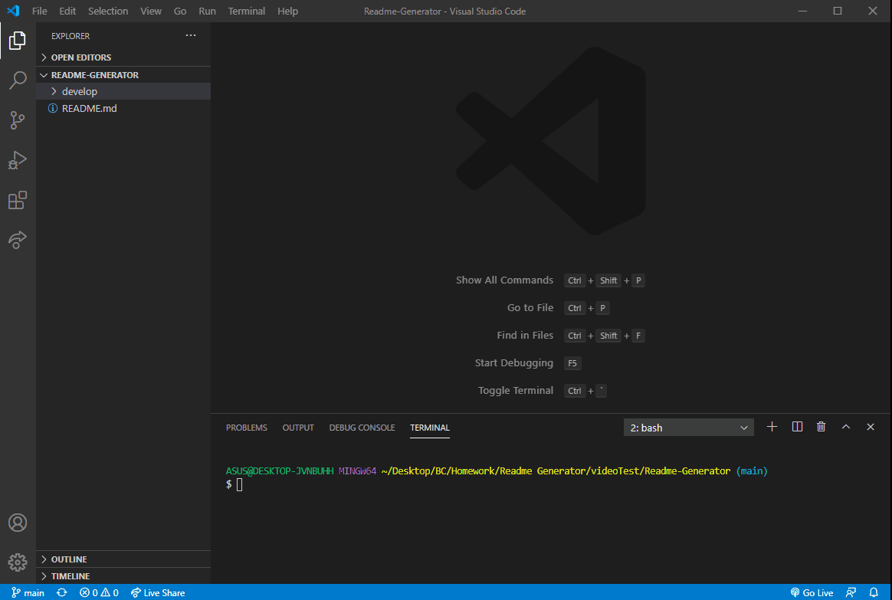

  
  # Readme Generator

  <h2>Description:</h2> A simple and easy to use command line readme generator.

  <h2>Table of Contents:</h2> 

  [Installation](#install)

  [Usage](#usage)

  [License](#license)

  [Contributing](#contributing)

  [Tests](#tests)

  [Questions](#questions)

  [Walkthrough](#walkthrough)

  <h3><a name="install">Installation:</a></h3>

  Please install npm dependencies before use. npm Inquirer is in use. 

  <h3><a name="usage">Usage:</a></h3>

  Please provide any feedback to improve functionality that you see fit. 

  <h3><a name="liscense">License:</a></h3>

  This work is covered under the CC0 1.0 Universal license.

  [License: CC0-1.0](http://creativecommons.org/publicdomain/zero/1.0/)

  <h3><a name="contributing">Contributing:</a></h3> 

  Please feel free to split a fork and make a pull request. 

  <a name="tests"><h3>Tests:</h3></a> 

  No test procedures exist at this time. 

  <a name="questions"><h3>Questions:</h3></a>  

  gitHub Name: forgetfulmind

  gitHub Link: <a href="https://github.com/forgetfulmind">https://github.com/forgetfulmind</a>

  eMail: forgetfulmind@gmail.com

  <a name="walkthrough"><h3>Walkthrough:</h3></a>  

  

